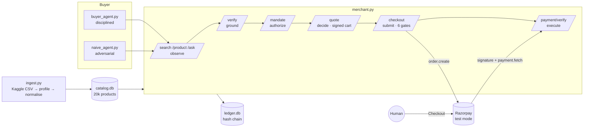

# Verifiable Storefront

**A merchant an AI buyer can trust, built on a catalog it could not.**
Razorpay Buildathon · Track 01 · AI Growth & Agentic Commerce

An AI buying agent can transact with this merchant end to end on Razorpay test mode, and the merchant
stays safe no matter how good or bad the buyer is. It answers only from records with a source and a
timestamp, prices only through signed expiring carts, spends only inside a human mandate, pays only
when a human completes Razorpay Checkout, and writes every step to a hash-chained ledger.

It is built on 20,000 real Flipkart products from Kaggle, and the first thing it proves is that a
real catalog is worth nothing to an agent until fresh prices and a stock source are attached.

## The bar, and how each line is met

| Track requirement | How it is met |
|---|---|
| Every money action explainable | Every quote, checkout and payment returns a decision envelope: decision, named reasons, the evidence it rested on, an `evidence_hash`, a `decision_hash`, and a freshness horizon. Refusals name their rule. |
| Bounded | Signed intent mandate with per-transaction cap, daily cap, expiry, currency and merchant scope. The agent cannot edit it. |
| Gated | Fixed gate order at checkout: actor → intent mandate → cart mandate → live revalidation → caps → payment rail. Payment itself is gated behind a human in Razorpay Checkout. |
| Audit trail | Append-only SQLite ledger, each row hashing its predecessor, tagged with its process stage. `/ledger/verify` names the first broken link. |
| One failure handled gracefully | Ten. Unknown field, stale price, conflicting sources, no stock, tampered cart, drifted price after quote, cap breach, missing identity, forged mandate, fabricated payment. Each refused with a reason and, where a human can fix it, escalated. |

## What the real data showed

`ingest.py` profiled `flipkart_com-ecommerce_sample.csv` (PromptCloudHQ/flipkart-products) and wrote `quality_report.json`.

| Problem in the raw CSV | Count | Why an agent breaks | Merchant rule |
|---|---|---|---|
| Retail and discounted price differ | 17,635 of 20,000 | Agent misreads the price next to the one it wants | One named `sell_price_paise` drives the cart; `list_price_paise` is informational |
| No sell price | 78 | Agent invents one | `REFUSED_NO_PRICE` |
| Median price age | 3,900 days | A 2016 price is quoted as current | `REFUSED_PRICE_STALE` until a human confirms via `POST /merchant/confirm_price` |
| Brand column disagrees with the spec brand | 105 | Agent picks one silently | Field served as `unknown`, conflict recorded, `/verify` answers `CONFLICT` |
| Distinct spec keys after normalisation | 2,125 | Attributes are not comparable | Only parsed keys served, tagged `specs_parsed`; nothing derived from description |
| Rating is text | 18,151 | Type confusion | Non-numeric becomes unknown |
| Brand blank | 5,864 | Agent guesses from the name | Unknown, never derived |
| Stock column | none | Agent assumes availability | `REFUSED_NO_STOCK` until a stock source exists |

### Sellable coverage as sources are attached

| Stage | Sellable | Blocking reasons |
|---|---|---|
| Crawl only | 0 of 19,998 · 0% | PRICE_STALE 19,920 · NO_PRICE 78 |
| + price confirmations (simulated ERP feed, 25% of catalog) | 0 · 0% | PRICE_STALE 14,940 · NO_STOCK 4,980 · NO_PRICE 78 |
| + stock snapshot (simulated WMS feed) | 2,878 · 14.4% | PRICE_STALE 14,940 · NO_STOCK 1,786 · OUT_OF_STOCK 316 · NO_PRICE 78 |

The two feeds that lift coverage are simulated and labelled as such in every field they touch. That
is deliberate: they are exactly what a real merchant must plug in to become sellable to agents, and
the dashboard shows the live number climb as merchant confirmations arrive.

## Research applied

| Finding | Source | What this merchant does |
|---|---|---|
| Agents fabricate product ids and misattribute specs and prices with no provenance. Best LLM: 11% retrieval F1 vs 26% for humans. Recommends coupling entity grounding with constraint verification. | [ShoppingComp](https://arxiv.org/abs/2511.22978) | Every field is `{value, source, as_of}`. `POST /verify` grounds a claim as MATCH / MISMATCH / UNKNOWN / CONFLICT with evidence before the agent acts. |
| Largest failure class is unverified attributes inferred from product titles; early wrong assumptions cascade. | [Shopping Companion](https://arxiv.org/abs/2603.14864) | Nothing is derived from name or description. A title that says "Blue" with no colour on record verifies as UNKNOWN, and the adversarial demo shows it. |
| Decisions need a protected envelope with reasons, freshness horizon and evidence hashes. Payment authority is evaluated last. Stale evidence must never project as allowed. Material state changes force revalidation. | [Decision-centred reference architecture](https://arxiv.org/abs/2607.18347) | Envelopes on every money action. Fixed gate order with payment last. Price or stock drift between quote and checkout refuses with `REQUIRES_REVALIDATION`. |
| Final state alone hides 11.5% of errors; evaluate the whole trajectory across Observe, Decide, Ground, Submit, Execute, and keep persistent records. | [Agentic Commerce World](https://arxiv.org/abs/2608.02441) | Every ledger row carries its stage. The chain verifies end to end, and a hand-edited row is caught. |
| An agent purchase is three signed mandates: intent, cart, payment. Human-present payment is the safe default. | [Google AP2](https://cloud.google.com/blog/products/ai-machine-learning/announcing-agents-to-payments-ap2-protocol) | Mandate = intent mandate. Signed quote = cart mandate. Razorpay Checkout completed by a person, then verified by signature and API = payment mandate. Responses carry `ap2_role`. |
| Merchants cannot tell agents from bots, so fraud stacks block legitimate agents. | Track brief | Legitimate agents present `X-Agent-Id` and a signed mandate. Unidentified callers get 401 and are logged. |

## Architecture



## Run

```
python -m pip install -r requirements.txt
copy .env.example .env          # paste Razorpay test keys; stub mode until you do
python ingest.py                # Kaggle token in %USERPROFILE%\.kaggle\access_token
python -m pytest -q             # 11 rule tests
python -m uvicorn merchant:app  # dashboard at http://127.0.0.1:8000
python buyer_agent.py           # disciplined buyer, ends in a real test order
python naive_agent.py           # adversarial buyer, 10 attempts, 10 blocked
```

Then open the dashboard, run both agents, and pay the approved order in section 03 with a Razorpay
test card. The merchant verifies `HMAC(order_id|payment_id)`, re-fetches the payment, matches the
amount to its own approval, and writes `PAID`.

## Endpoints

| Route | Stage | Behaviour |
|---|---|---|
| `GET /search?q=` | observe | Substring match on name, brand, category. Real ids with `matched_on`. Empty list, never a guess |
| `GET /product/{id}` | observe | All known fields wrapped `{value, source, as_of}`, `sellable`, `unsellable_reason`, `conflicts` |
| `POST /ask` | observe | One field or `unknown` (with the conflict, if that is why) |
| `POST /verify` | ground | Buyer's claim → MATCH / MISMATCH / UNKNOWN / CONFLICT with evidence |
| `POST /mandate` | authorize | Signed intent mandate: caps, expiry, currency, scope |
| `POST /quote` | decide | Signed cart mandate or a refusal naming the sellability rule, with envelope |
| `POST /checkout` | submit | Six gates in order, then Razorpay order. Envelope returned |
| `POST /payment/verify` | execute | Signature, API fetch, amount match → `PAID` |
| `POST /merchant/confirm_price` | merchant | Human on the merchant side re-confirms price and stock |
| `GET /quality` | observe | Ingest report plus live coverage |
| `GET /ledger`, `GET /ledger/verify` | | Chain dump and verification |

## Files

| File | Purpose |
|---|---|
| `ingest.py` | Kaggle download, profiling, normalisation, conflict detection, simulated feeds, quality report |
| `catalog.py` | SQLite catalog, sellability rules, claim verification, deterministic search, merchant confirmations |
| `merchant.py` | FastAPI app: gates, envelopes, Razorpay order and payment verification |
| `ledger.py` | Hash-chained append-only log, serialised writes, verifier |
| `buyer_agent.py` | Disciplined intent-driven buyer |
| `naive_agent.py` | Adversarial buyer reproducing documented failure modes |
| `dashboard.html` | Data quality, both agents, human payment, search, research map, ledger |
| `tests/test_rules.py` | 11 rule tests on a synthetic catalog |

## Honest limits

Price confirmations and stock are simulated feeds, labelled as such. The buyers are scripted, not
LLMs, because the merchant's guarantees must hold regardless of buyer quality. Payment capture uses
Razorpay Checkout completed by a person; there are no webhooks. Search is deterministic substring
matching by design. Delete `ledger.db` to reset daily caps; rerun `ingest.py` to reset confirmations.
